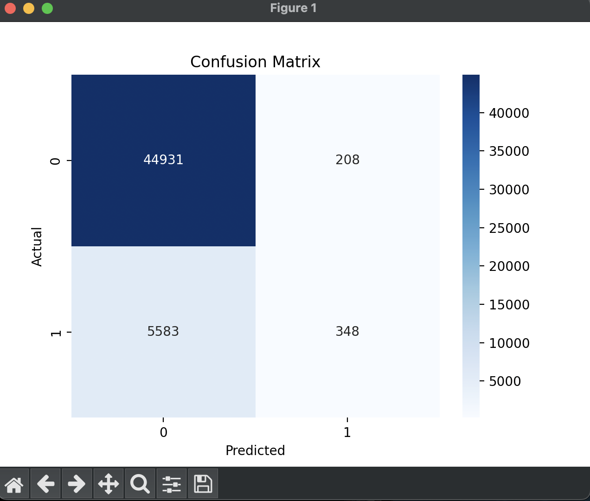
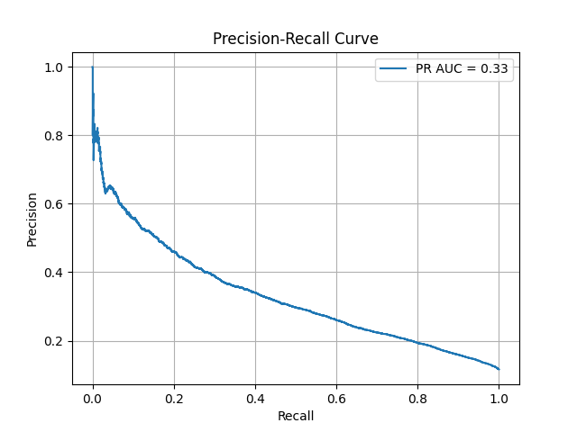
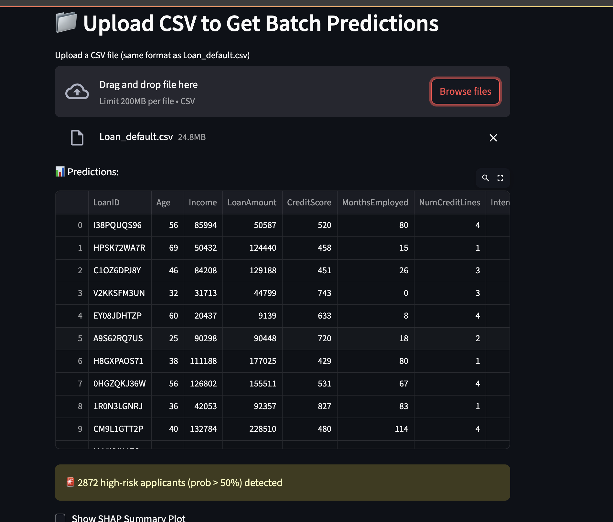

# **production ready, v1.01**

# Credit Risk Classifier  AI-Powered Loan Default Predictor

This project simulates a lightweight credit risk engine similar to what fintechs or prop trading firms like **Akuna Capital** might use for real-time underwriting, risk flagging, or capital allocation decisions.


A machine learning application that predicts the probability of loan default based on customer financial data. Designed for financial institutions like JPMorgan and Capital One to automate risk underwriting with interpretable insights.


Additionally,  practical ML application that helps banks and lenders automatically assess loan risk. It uses customer financial data (income, credit score, loan amount, etc.) to estimate the **probability of default** — like how JPMorgan or Capital One might screen applicants during underwriting.


**Use Case**:  
> "Can we tell, in seconds, whether this person is a low-risk borrower?"

This tool answers that — with both predictive power and explainability (via SHAP).  
It turns messy CSVs into clear visual decisions.

---

## (in Simple Terms)

Think of this app like a **digital loan officer assistant**:

- You type in someone's income, credit score, etc. (or upload a CSV)
- The trained ML model predicts: _What's the chance they won't pay us back?_
- It uses XGBoost — a model trained on real-world patterns
- It explains the reasoning visually using SHAP (like saying: “This person’s low credit score hurt their chances”)

**Analogy**:  
It’s like TurboTax — but for risk analysis instead of taxes.

---

## Who This Is For

- **Banks & Fintechs**: Streamline risk scoring for consumer lending
- **Analysts**: Get transparency into why a loan is flagged as risky
- **Students/Builders**: Learn end-to-end ML pipeline + UI + explainability


## Image Gallery – Model Insights & UI

Visual examples from the pipeline and Streamlit app. Each graphic helps explain how this tool works for both technical and non-technical audiences.

| 🔍 What You See | 🧠 What It Shows |
|----------------|------------------|
|  | A performance summary: how well the model predicts defaults vs non-defaults. Great for model audit snapshots. |
|  | Shows the tradeoff between precision and recall — especially helpful in imbalanced datasets like credit risk. |
|  | A global SHAP beeswarm plot that highlights which features push the model toward predicting risk. Think of this as “what the model pays attention to”. |
|  | A look at the real-time scoring UI, where users input data manually or upload a CSV to get loan risk predictions. |


# DOCS (in progress)

---

## How to Use the Streamlit Interface

### ➤ Manual Mode
1. Run the app:
   ```bash
   streamlit run app/streamlit.py


---

## Features

- **Exploratory Data Analysis** (EDA) – Understand correlations, outliers, and data health
- **Modeling** – Logistic Regression, Random Forest, and XGBoost with Grid Search
- **Explainability** – SHAP visualizations to satisfy regulatory transparency
- **Streamlit App** – Real-time prediction interface with interpretability toggle

---

## Tech Stack

- Python · Pandas · Scikit-learn · XGBoost  
- Streamlit (UI) · SHAP (model explanations)  
- Matplotlib & Seaborn (visualization)

## Text UML/ Pipeline
```
1. Data Understanding
   ├─ Gather example datasets (e.g., LendingClub, Kaggle credit datasets)
   ├─ Explore feature types: income, credit score, loan amount, etc.
   └─ Identify target variable (loan default = 0/1)

2. Exploratory Data Analysis (EDA)
   ├─ Correlation analysis, outlier detection
   ├─ Missing value imputation
   └─ Visualizations: boxplots, heatmaps, histograms

3. Data Preprocessing
   ├─ Encoding categorical variables
   ├─ Normalization/Standardization
   └─ Train-test split (stratified)

4. Model Development
   ├─ Baseline: Logistic Regression
   ├─ Advanced: Random Forest, XGBoost
   ├─ Cross-validation (e.g., StratifiedKFold)
   └─ Hyperparameter tuning (GridSearchCV / Optuna)

5. Model Evaluation
   ├─ Metrics: ROC AUC, F1, Precision-Recall
   └─ Confusion matrix visualizations

6. Interpretability
   ├─ Feature importance (XGBoost built-in)
   └─ SHAP plots (force, beeswarm, summary)

7. Streamlit App
   ├─ Input form for user financial data
   ├─ Risk prediction output
   └─ Display SHAP explanations

8. Deployment (Optional)
   └─ Streamlit Cloud / Dockerize for local hosting
```

## CreditRiskClassifier File Structure 

```
├── data/
│   ├── raw/
│   └── processed/
│
├── notebooks/
│   ├── 01_eda.ipynb
│   └── 02_model_dev.ipynb
│
├── src/
│   ├── data_prep.py
│   ├── train_model.py
│   ├── evaluate.py
│   └── shap_analysis.py
│
├── app/
│   └── streamlit_app.py
│
├── models/
│   └── xgb_credit_model.pkl
│
├── requirements.txt
├── README.md
└── .gitignore
```

---


## How to Run

1. **Install Dependencies**

   ```bash
   pip install -r requirements.txt


## DEV WORKFLOW 

1. Activate venv
source venv/bin/activate

2. If retraining is needed
python run_pipeline.py

3. Launch UI
streamlit run app/streamlit.py
