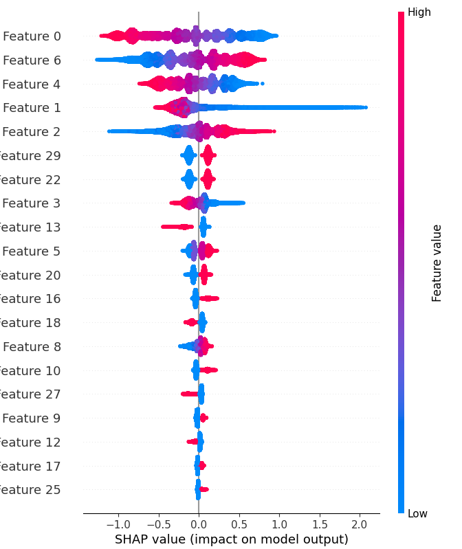

# **production ready, v1.01**

# Credit Risk Classifier  AI-Powered Loan Default Predictor

This project simulates a lightweight credit risk engine similar to what fintechs or prop trading firms like **Akuna Capital** might use for real-time underwriting, risk flagging, or capital allocation decisions.


A machine learning application that predicts the probability of loan default based on customer financial data. Designed for financial institutions like JPMorgan and Capital One to automate risk underwriting with interpretable insights.


Additionally, this project is a practical demonstration of machine learning applied to **financial decision support**. It helps simulate how institutions might assess loan risk by analyzing borrower-related features (like income, credit score, loan amount, etc.) to estimate the **likelihood of repayment challenges** — similar to tools used in responsible lending and credit assessment.

---

**Use Case**:  
> "Can we estimate, with transparency, how various financial factors influence lending decisions?"

This tool enables that — combining predictive insights with model explainability (via SHAP).  
It transforms complex CSV data into clear, interpretable visual guidance.

---

## 🧠 In Simple Terms

Think of this app like a **virtual assistant for financial analysis**:

- You input details like income, credit score, and loan amount (or upload a CSV)
- The ML model estimates the **relative risk** based on patterns from past data
- It uses XGBoost — a fast, interpretable machine learning model
- It also shows **why** the model made its decision using SHAP (e.g., “Low income and high loan size contributed to higher risk”)

**Analogy**:  
It’s like a **financial calculator with explainable reasoning** — helping analysts or students understand risk patterns, not pass judgment.

> ⚠️ Note: This tool is for educational purposes and should **not** be used to make real-world lending decisions.
---

## Who This Is For

- **Banks & Fintechs**: Streamline risk scoring for consumer lending
- **Analysts**: Get transparency into why a loan is flagged as risky
- **Students/Builders**: Learn end-to-end ML pipeline + UI + explainability


## Image Gallery – Model Insights & UI

Visual examples from the pipeline and Streamlit app. Each graphic helps explain how this tool works for both technical and non-technical audiences.

| 🔍 What You See | 🧠 What It Shows |
|----------------|------------------|
|  | A performance summary: how well the model predicts defaults vs non-defaults. Great for model audit snapshots. |
|  | Shows the tradeoff between precision and recall — especially helpful in imbalanced datasets like credit risk. |
|  | A global SHAP beeswarm plot that highlights which features push the model toward predicting risk. Think of this as “what the model pays attention to”. |
|  | A look at the real-time scoring UI, where users input data manually or upload a CSV to get loan risk predictions. |


# DOCS (in progress)
current scores (as of 7/3/25)
ROC AUC: 0.7591999315970401
              precision    recall  f1-score   support

           0       0.89      1.00      0.94     45139
           1       0.63      0.06      0.11      5931

    accuracy                           0.89     51070
   macro avg       0.76      0.53      0.52     51070
weighted avg       0.86      0.89      0.84     51070

Metric	Meaning
Accuracy	89% of total predictions were correct
Macro Avg	Unweighted average over both classes (fairer)
Weighted Avg	Average, weighted by class size (skewed by class 0)


---

## How to Use the Streamlit Interface

### ➤ Manual Mode
1. Run the app:
   ```bash
   streamlit run app/streamlit.py


---

## Features

- **Exploratory Data Analysis** (EDA) – Understand correlations, outliers, and data health
- **Modeling** – Logistic Regression, Random Forest, and XGBoost with Grid Search
- **Explainability** – SHAP visualizations to satisfy regulatory transparency
- **Streamlit App** – Real-time prediction interface with interpretability toggle

---

## Tech Stack

- Python · Pandas · Scikit-learn · XGBoost  
- Streamlit (UI) · SHAP (model explanations)  
- Matplotlib & Seaborn (visualization)

## Text UML/ Pipeline
```
1. Data Understanding
   ├─ Gather example datasets (e.g., LendingClub, Kaggle credit datasets)
   ├─ Explore feature types: income, credit score, loan amount, etc.
   └─ Identify target variable (loan default = 0/1)

2. Exploratory Data Analysis (EDA)
   ├─ Correlation analysis, outlier detection
   ├─ Missing value imputation
   └─ Visualizations: boxplots, heatmaps, histograms

3. Data Preprocessing
   ├─ Encoding categorical variables
   ├─ Normalization/Standardization
   └─ Train-test split (stratified)

4. Model Development
   ├─ Baseline: Logistic Regression
   ├─ Advanced: Random Forest, XGBoost
   ├─ Cross-validation (e.g., StratifiedKFold)
   └─ Hyperparameter tuning (GridSearchCV / Optuna)

5. Model Evaluation
   ├─ Metrics: ROC AUC, F1, Precision-Recall
   └─ Confusion matrix visualizations

6. Interpretability
   ├─ Feature importance (XGBoost built-in)
   └─ SHAP plots (force, beeswarm, summary)

7. Streamlit App
   ├─ Input form for user financial data
   ├─ Risk prediction output
   └─ Display SHAP explanations

8. Deployment (Optional)
   └─ Streamlit Cloud / Dockerize for local hosting
```

## CreditRiskClassifier File Structure 

```
├── data/
│   ├── raw/
│   └── processed/
│
├── notebooks/
│   ├── 01_eda.ipynb
│   └── 02_model_dev.ipynb
│
├── src/
│   ├── data_prep.py
│   ├── train_model.py
│   ├── evaluate.py
│   └── shap_analysis.py
│
├── app/
│   └── streamlit_app.py
│
├── models/
│   └── xgb_credit_model.pkl
│
├── requirements.txt
├── README.md
└── .gitignore
```

---


## How to Run

1. **Install Dependencies**

   ```bash
   pip install -r requirements.txt


## DEV WORKFLOW 

1. Activate venv
source venv/bin/activate

2. If retraining is needed
python run_pipeline.py

3. Launch UI
streamlit run app/streamlit.py
